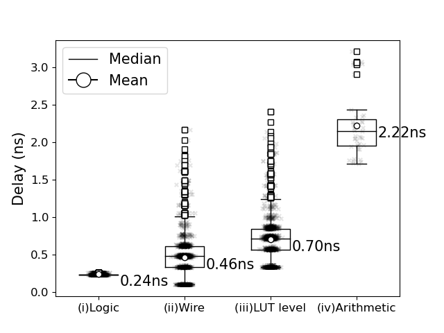

Delay characterization
======================

We determine the LUT level delay and carry chain delay by characterizing all the delays in the critical path's timing report.

The code can be found in ``Experiments/delay_characterization/raw/retrieve_timing.py``.

The figure below shows the delay distribution measured in our flow for the following constructs: (i) inside a single LUT, (ii) on the wire between two LUTs, (iii) the effective LUT level delay (i.e., the sum of the single LUT delay and the surrounding wiring), and (iv) an arithmetic unit (including the wire delays to and from the arithmetic units).

For example, if the target clock period is 4.2 ns, then we derive that the maximum number of LUT levels is 6, and the DSPs take 4 LUT levels. 